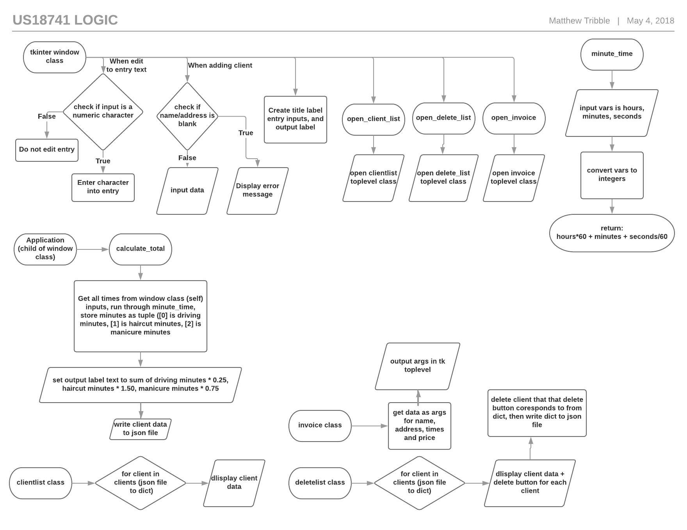
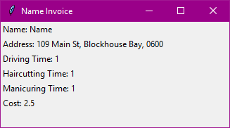
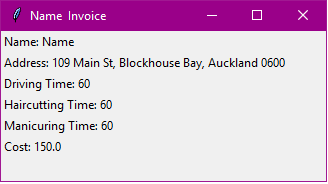
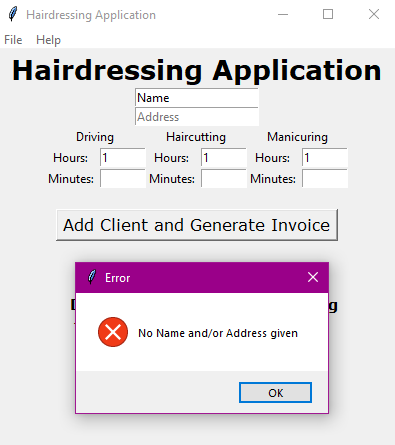
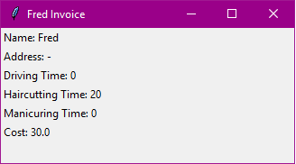
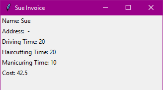

# Unit Standard US18741 

## How to Use

The program is under a shortcut with the name 'Hairdressing Application', and the source code is located in the folder 'source'

To add a new client, fill in all the text boxes (if a box taking a time is blank, it will default to 0) and click the "Add Client and Generate Invoice" button

To delete a Client, go to File -> Delete A Client, and click "Delete" on the client you wish to remove

To view all of the current day's client, go to File -> Show Todays Clients

# Plan

## Brief

The program will be used by a mobile hairdresser (however for the sake of the assesment it will be Raymond Feng), to:
*	Calculate Pricing of jobs based on minutes worked, and generate invoices of jobs.
*	Store the information of clients and respective job information.
    
The program will be made with Python 3.5, using tkinter as the base of a GUI interface, to
make the program simple for anybody to use, with clear buttons, entries and instructions.

## Data Sheet

### Global

	def time_to_minutes - take time in hours and minutes and convert it to minutes only
	dict cost - predefine costs to easily change later

### Classes

	class WindowApplication - child class of tk Frame, defines all window widgets and some functionality
		def __init__ - define all widgets
		def open_client_list - create instance of ClientList
		def open_delete_list - create instance of DeleteClient
		def help - open help box
	
	tk.Entry(s) - entries for time in hours and minutes of driving, haircutting and manicuring
	
	class HairdressingApplication - child class of WindowApplication, defines functionality of window
		def add_client - add a client/generate invoice
		def get_totals - get all the totals of the entries
	

	class DeleteClient - tk Toplevel for deleting clients
		def __init__ - initialize window
	class ClientList - tk Toplevel for list of clients
		def __init__ - initialize window
	class Invoice - tk Toplevel for invoice windo
		def __init__ - initialize window
		
## Structure

# Program Analysis

## Schedule

9/04/18
*	Start planning. Start on flowchart, planning the logic that the program will utilize
11/04/18
*	Start programming. Begin building the GUI interface, creating all the buttons, widgets and labels that will be used
15/04/18
*	Start on logic. Make the program function by adding the ability to add/remove clients, and invoice generation
2/05/18
*	Meeting with Raymond Feng. Testing of program, and final adjustments based on testing
4/05/18
*	Final touches added, handed in. Finished
	
## Testing

Test | Expected Result | Actual Result | Pass/Fail |
--- | --- | --- | --- |
(1) Type W in any time entry | Keystroke will fail to input | Keystroke failed to input | Pass |
(2) Have name as 'Name', Address as '109 Main St, Blockhouse Bay, Auckland 0600' and all times as 1 minute| To add the client,  generate an invoice of 1 minute for driving, haircutting and manicuring, and have a total cost of $2.50| Added clientof name 'name', generated invoice of 1 minute for driving, haircutting and manicuring, and had a total cost of $2.50 | Pass |
(3) Same as above but 1 hour for each instead of 1 minute | Same as above but with 1 hour, and total cost of $150 | Same as above but with 1 hour, and total cost of $150 | Pass |
(4) Same as abouve but with blank address | Error message for not adding name/address | Error message for not adding name/address | Pass |
(5) Client Fred, 0 Drive, 20 Hair, 0 Manicuring | Invoice for $30 | Invoice for $30 | Pass |
(6) Client Sue, 20 Drive, 20 Hair, A Manicuring | Don't allow A input | Don't allow A input | Pass |
(7) Change above to 10 Manicuring | Invoice for $42.50 | Invoice for $42.50 | Pass | 

Test 2

Test 3

Test 4

Test 5

Test 7

## Final Thoughts of Finished Program

The program can preform all the functions that the brief requires, it can add, remove and generate invoices for clients with the cost being calculated by minute for each specific job.